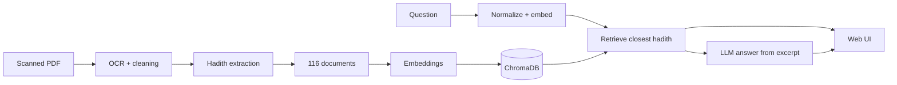

# Arbaeen Nawawi: Arabic RAG Q&A

Ask questions in Arabic about *Al-Arbaeen Al-Nawawiyyah* and get answers grounded in the book itself.

The system finds the most relevant hadith, shows its full text with the explanation (sharh) and the narrator's biography, then writes a short sourced answer. The LLM answers **only from the retrieved excerpt**, cites hadith numbers, and says "I don't know" when the answer isn't in the text.

<!-- Add a screenshot or GIF here:  -->

## Contents

- [Arbaeen Nawawi: Arabic RAG Q\&A](#arbaeen-nawawi-arabic-rag-qa)
  - [Contents](#contents)
  - [Overview](#overview)
  - [How It Works](#how-it-works)
  - [Quick Start](#quick-start)
    - [Example](#example)
  - [Project Structure](#project-structure)
  - [Models](#models)
  - [Retrieval Quality](#retrieval-quality)
  - [Limitations and Roadmap](#limitations-and-roadmap)
  - [Data Sources and Disclaimer](#data-sources-and-disclaimer)
  - [Author](#author)
  - [License](#license)

## Overview

- **Corpus:** 42 hadiths with explanations and narrator biographies, indexed as 116 documents (42 matn, 42 sharh, 32 bios).
- **Source book:** a scanned 32-page PDF with no text layer, so OCR is required.
- **Search:** semantic search over Arabic embeddings in a local ChromaDB index.
- **Generation:** grounded answers via OpenRouter, with automatic fallback to a backup model.
- **Matching:** diacritics are stripped on both the index side and the query side.
- **Runtime:** CPU-friendly. Embeddings are precomputed, so only the query is embedded on the fly.

## How It Works



The top row is built once offline. The bottom row runs on every question: the query goes through the same normalization and embedding, then retrieval combines dense search with BM25 keyword search (RRF fusion); explicit references ("Hadith 1", "الأول") resolve directly by number. If the best similarity is below threshold (0.35), the app says no suitable hadith was found instead of guessing. Otherwise the LLM writes the answer using only the top excerpts. The sharh and narrator biography are fetched by hadith number and shown alongside.

## Quick Start

**Requirements:** Python 3.11 and an [OpenRouter](https://openrouter.ai/) API key. Tesseract OCR is only needed for the legacy OCR cells.

```bash
git clone https://github.com/mohamedhanfi/Arbaeen-Nawawi-RAG.git
cd Arbaeen-Nawawi-RAG
pip install -r requirements.txt
```

Create a `.env` file in the project root (it is git-ignored, so never put keys in code):

```env
huggingface_Access_Tokens=hf_...
OPENROUTER_API_KEY=sk-or-v1-...
```

Run the app (silent, no terminal window):

double-click `run_web.vbs` (opens the browser automatically).

For visible logs use `run_web_debug.bat`; to stop the server use `stop_web.vbs`.

Or manually (one process serves API + frontend, no CORS):

```bash
python -m uvicorn backend.main:app --host 127.0.0.1 --port 8501
```

Then open <http://localhost:8501>. API docs (dev only): <http://localhost:8501/docs>.

### Example

```text
> ما هو حديث النهي عن الغضب؟

حديث رقم 16: النهي عن الغضب

عن أبي هريرة رضي الله عنه قال: جاء رجل إلى النبي ﷺ وقال: أوصني، فقال: (لا تغضب).
رواه البخاري.

[شرح الحديث 16]
لم يبين هذا الرجل... قال: (لا تغضب) الغضب: بين النبي ﷺ أنه جمرة
يلقيها الشيطان في قلب ابن آدم...

[معلومات الراوي]
أبو هريرة هو عبد الرحمن بن صخر الدوسي...
```

## Project Structure

```text
.
├── backend/                    # FastAPI: config.py, rag.py, main.py (API + static frontend)
├── frontend/                   # Static chat UI: index.html, styles.css, app.js
├── run_web.vbs                 # Silent Windows launcher (no terminal)
├── run_web_debug.bat           # Launcher with visible console logs
├── stop_web.vbs                # Stops the local server
├── RAG_STAGES.md               # Full technical reference
├── requirements.txt
├── .env                        # API keys (git-ignored)
├── Book/
│   └── Arbaeen-Nawawi-book.pdf
├── src/                        # Data pipeline, in order
│   ├── document_loading.ipynb  # PDF -> images -> EasyOCR -> ocr_pages.json
│   ├── text_cleaning.ipynb     # OCR correction and diacritic stripping
│   ├── hadith_extraction.ipynb # Split the 42 hadiths with metadata
│   ├── create_documents.ipynb  # Build the 116 searchable documents
│   ├── embeddings.ipynb        # Vectorize documents + accuracy tests
│   ├── chromadb.ipynb          # Load into ChromaDB
│   └── retrieval.ipynb         # Search function + 10-question test
├── data/
│   ├── ocr_pages.json                 # Raw OCR output
│   ├── cleaned_pages.json             # After LLM correction
│   ├── corrected_pages(F V).json      # Final corrected pages
│   ├── hadith_extraction.json         # 42 hadiths from the OCR
│   ├── hadith_extraction_clean.json   # Main data file
│   ├── documents.json                 # The 116 indexed documents
│   └── hadith_embeddings.npy          # 116 x 768 vectors
└── chroma_db/                  # Local vector database
```

If `documents.json` changes, rebuild `hadith_embeddings.npy` and then the ChromaDB collection. If `chroma_db/` goes out of sync, delete it and rebuild via `src/chromadb.ipynb`.

## Models

| Role | Model |
|---|---|
| OCR | EasyOCR (Arabic) + PyMuPDF |
| Embeddings | `omarelshehy/Arabic-Retrieval-v1.0` (768-dim) |
| Generation | `nvidia/nemotron-3-ultra-550b-a55b:free`, fallback `nex-agi/nex-n2.5-mini:free` (OpenRouter) |


## Limitations and Roadmap

**Limitations**

- Free OpenRouter models can be rate-limited (fallback chain + partial-answer recovery mitigate this).
- The evaluation set is small (10 questions).
- Ordinal references cover masculine forms only ("الأول".."الثاني والأربعون").

**Roadmap**

- [x] Retrieve top 3 hadiths and show related ones
- [x] Similarity threshold with a "no relevant hadith found" state
- [x] Hybrid search (BM25 + embeddings, RRF fusion)
- [x] Streaming answers and better error handling
- [x] Chat UI redesign (Arabic typography, dark mode)
- [ ] Larger evaluation set with hit@1 / hit@3
- [ ] Optional reranker
- [ ] Public demo on Hugging Face Spaces

## Data Sources and Disclaimer

Indexed matn, sharh, and narrator bios come from alnawawiforty.com. Page numbers and hadith boundaries come from the book's OCR, so edition differences may exist. Check the source site's terms before redistributing the scraped data.

